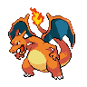
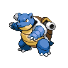
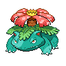
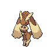

<div align="center">







# 랜덤 포켓몬 뽑기

**세대 · 타입 · 종족값을 정해두고 랜덤으로 파티를 굴린다.**
마음에 드는 한 마리는 스타팅으로 데려가 개체값 · 성격 · 특성까지 돌린다.

### [▶ rand-poki.vercel.app](https://rand-poki.vercel.app)

<sub>
전국도감 1~1025번 + 리전폼·고유 폼 127종 · 8개국어 · 도트 이미지 전부 내장 —
런타임에 외부 API를 한 번도 부르지 않는다
</sub>

<br>


</div>

---

## 🎲 이런 걸 한다

**조건을 걸고 뽑는다**
세대(1~9) · 타입 18종(`아무거나`/`정확히`) · 2타입만 · 진화 단계 · 종족값 총합 범위 ·
전설/환상 제외 · 같은 진화 계열 중복 방지. 조건에 맞는 마리 수가 실시간으로 보인다.

**조건을 바꿔도 뽑은 건 안 날아간다**
재추첨은 버튼을 눌러야 일어난다. 필터를 이리저리 만져봐도 파티는 그대로다.

**카드 단위로 손본다**
파티는 최대 6마리. 마음에 안 드는 카드만 🎲 리롤하거나 ✕ 삭제한다.
특정 포켓몬을 꽂고 싶으면 **직접 추가** — 이름 · 도감번호는 물론
**초성**으로도 찾는다 (`ㅍㅋㅊ` → 피카츄).

**다른 모습으로 바꾼다**
리전폼(알로라 · 가라르 · 히스이 · 팔데아)과 로토무 · 데오키시스 같은 고유 폼 127종.
카드에서 모습을 고르면 도트 · 타입 · 종족값 · 특성이 그 모습 것으로 바뀐다.
추첨은 도감 1025종 단위라 같은 포켓몬이 모습 때문에 중복으로 뽑히지 않는다.

**스타팅을 정한다**
특성 · 개체값 6종 · 성격을 하나씩 돌리거나 직접 지정하고,
레벨 50 실능력치를 막대로 본다. 돌릴 때는 슬롯머신처럼 스핀하고 소리도 난다
(오디오 파일 없이 Web Audio로 합성).

**링크로 공유한다**
필터 조건이 주소에 담긴다. 결과는 안 담기니 같은 조건으로 각자 뽑으면 된다.

<sub>표시 옵션에서 언어 8종 · 도트 이미지 · 도감번호 · 타입 · 종족값을 즉시 끄고 켤 수 있다.
첫 방문에는 사용 설명서가 한 번 뜨고, 이후엔 `? 사용법` 버튼으로 다시 연다.</sub>

---

## 🛠 만들기

> **Node 22.22 이상**이 필요하다. 그 아래에서는 `react-router` CLI가 실행을 거부한다.

```bash
npm install
npm run dev        # http://localhost:5173
```

| 스크립트 | 설명 |
| --- | --- |
| `npm run dev` | 개발 서버 (HMR) |
| `npm run build` | 프로덕션 빌드 → `build/` |
| `npm start` | 빌드 결과 서빙 |
| `npm test` | 순수 로직 단위 테스트 (vitest) |
| `npm run typecheck` | 라우트 타입 생성 + `tsc` |
| `npm run fetch:pokemon` | PokeAPI → `data/*.json` (폼 포함) |
| `npm run fetch:sprites` | 도트 이미지 내려받기 (원종 + 폼) |

---


<div align="center">
<sub>

이미지·데이터 출처 [PokeAPI](https://pokeapi.co) · 포켓몬 및 관련 상표는 닌텐도/게임프리크/크리처스의 자산이며
이 프로젝트는 비영리 팬메이드다

**made by [seojoon1](https://github.com/seojoon1)**

</sub>
</div>
